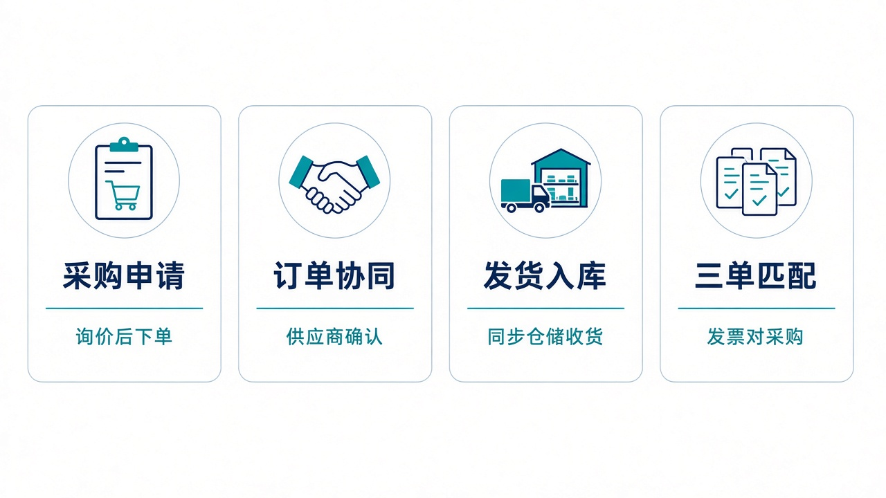
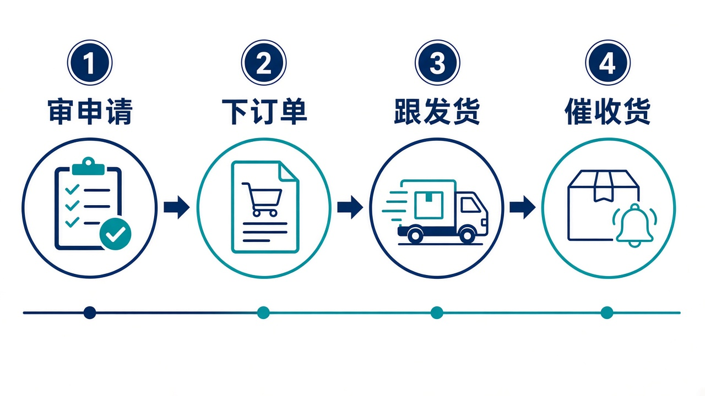

# 给大家讲：供应商系统怎么用

SRM 把采购从申请做到收货和发票匹配，并和仓储、ERP 演示连上。控制塔可以下采购建议、提交、审批和催单，询价和三单匹配仍在本系统。亮点短表见 [项目亮点](./项目亮点.md)。

## 适合什么场景

| 场景 | 在这里怎么做 |
| --- | --- |
| 要买一批料 | 建采购申请，询价后再下采购订单 |
| 供应商确认并发货 | 订单协同后产生发货通知，下发为仓储入库单 |
| 仓库收完货 | 回传数量，本系统生成收货单，并模拟 ERP 收货过账 |
| 供应商发票来了 | 做采购、收货、发票的三单匹配 |
| 货要晚了 | 控制塔或本系统按采购订单号催单 |

## 亮点

1. 申请、询价、订单、发货、收货、考核、匹配是一条链路。
2. 发货通知不会停在采购系统里，会变成仓储的入库单。
3. 控制塔越不过单据状态。建议生成的是申请，不是已经发给供应商的订单。
4. 没有开放密钥时，控制塔可以用业务账号登录后创建、提交、审批和催单。

## 一天怎么用

1. 审采购申请，确认数量、工厂和需求日期。
2. 下订单并等供应商确认。
3. 跟发货通知，看仓储是否已经收货。
4. 快延误的订单催单。收货完成后才进入匹配和考核。
