# SRM 供应商管理系统 — 项目汇报

> 汇报范围：从零搭建的采购协同 SRM，打通「采购申请 → 采购订单 → SAP 下发 → 供应商发货 → WMS 入库 → SAP 记账 → 供应商考核 → 发票三单匹配」全链路。
> 配套材料：[README](../README.md)（安装与接口）、[技术方案](./技术方案.md)（控制塔接口）、[图文导读](./图文导读.md)、[项目亮点](./项目亮点.md)。

---

## 1. 项目背景与目标

| 痛点 | 目标 |
| --- | --- |
| 采购单在邮件/Excel 里流转，SAP 只记结果 | 采购申请、询价、订单在系统内闭环，审批后自动下发 SAP |
| 供应商何时发货、发了多少，采购看不到 | 供应商门户自助确认订单、提交发货通知（ASN） |
| 仓库收货与采购脱节，手工对数 | ASN 自动生成 WMS 入库单，收货结果回传后自动算合格数并向 SAP 过账 |
| 供应商好坏靠感觉 | 按准时率、数量准确率、质量率 + 仓储评分自动打分分级 |
| 发票、订单、收货三方核对靠人 | 供应商提交发票即自动 3-way match，不符原因直接落库 |

设计参考 SAP Ariba 的「寻源 — 订单协同 — 收货 — 结算 — 绩效」分层，作为采购协同中台，对接标准 SAP（MM）与仓储管理系统（WMS）。

---

## 2. 业务主流程

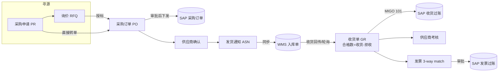
```mermaid
flowchart LR
  subgraph 寻源
    PR[采购申请 PR] --> RFQ[询价 RFQ]
  end
  RFQ -->|授标| PO[采购订单 PO]
  PR -->|直接转单| PO
  PO -->|审批后下发| SAP1[(SAP 采购订单)]
  PO --> CONF[供应商确认]
  CONF --> ASN[发货通知 ASN]
  ASN -->|同步| WMS[(WMS 入库单)]
  WMS -->|收货回传/轮询| GR[收货单 GR<br/>合格数=收货-拒收]
  GR -->|MIGO 101| SAP2[(SAP 收货过账)]
  GR --> EVAL[供应商考核]
  GR --> INV[发票 3-way match]
  INV -->|审批| SAP3[(SAP 发票过账)]
```

一次完整流转（mock 模式，冒烟脚本实际执行）：

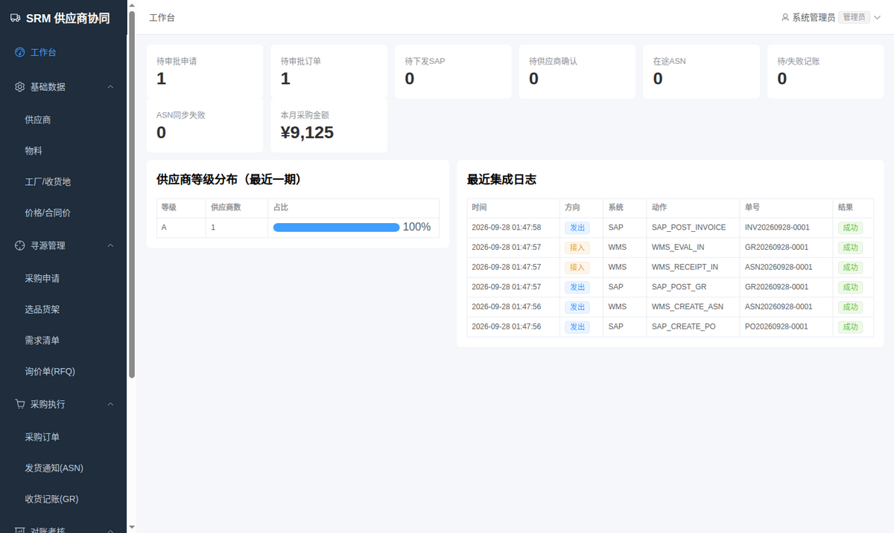

工作台展示待办数量、供应商等级分布，以及与 SAP/WMS 的最近 6 条集成往来：`SAP_CREATE_PO → WMS_CREATE_ASN → SAP_POST_GR → WMS_RECEIPT_IN → WMS_EVAL_IN → SAP_POST_INVOICE`。

---

## 3. 系统架构

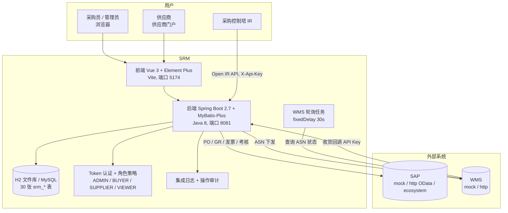
```mermaid
flowchart TB
  subgraph 用户
    B[采购员 / 管理员<br/>浏览器]
    S[供应商<br/>供应商门户]
    CT[采购控制塔 IR]
  end
  subgraph SRM
    FE[前端 Vue 3 + Element Plus<br/>Vite, 端口 5174]
    BE[后端 Spring Boot 2.7 + MyBatis-Plus<br/>Java 8, 端口 8081]
    DB[(H2 文件库 / MySQL<br/>30 张 srm_* 表)]
    AUTH[Token 认证 + 角色策略<br/>ADMIN / BUYER / SUPPLIER / VIEWER]
    LOG[集成日志 + 操作审计]
    JOB[WMS 轮询任务<br/>fixedDelay 30s]
  end
  subgraph 外部系统
    SAP[(SAP<br/>mock / http OData / ecosystem)]
    WMS[(WMS<br/>mock / http)]
  end
  B --> FE --> BE
  S --> FE
  CT -->|Open IR API, X-Api-Key| BE
  BE --> DB
  BE --> AUTH
  BE --> LOG
  BE -->|PO / GR / 发票 / 考核| SAP
  BE -->|ASN 下发| WMS
  WMS -->|收货回调 API Key| BE
  JOB -->|查询 ASN 状态| WMS
```

**技术选型**

| 层次 | 选型 | 说明 |
| --- | --- | --- |
| 前端 | Vue 3.5 / Element Plus 2.9 / Vue Router 4 / Axios | 单页应用，按角色渲染菜单，供应商门户独立路由 |
| 后端 | Spring Boot 2.7.18 / MyBatis-Plus 3.5 / Lombok | 按业务域分包：basic、sourcing、purchase、delivery、receipt、evaluation、invoice、integration、system |
| 数据 | H2（文件库，零安装）/ MySQL | `schema.sql` + `data.sql` 启动即带演示数据 |
| 集成 | 接口抽象 `SapClient` / `WmsClient`，多实现按 `SRM_SAP_MODE` / `SRM_WMS_MODE` 切换 | mock 默认可离线演示；http 对接真实系统 |
| 发布 | GitHub Actions + jpackage | Windows / macOS / Linux 一键运行包，端口 8087 |

**规模**：后端 Java 约 7,000 行、前端约 2,500 行、85 个 REST 端点、30 张表、7 个单元测试类 + 2 个端到端冒烟脚本，共 19 个 PR 迭代交付。

---

## 4. 功能模块

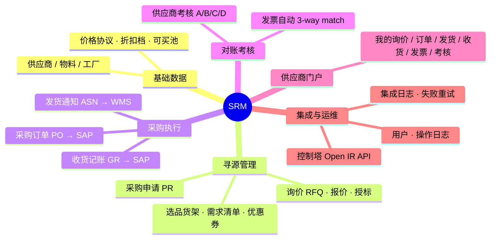
```mermaid
mindmap
  root((SRM))
    基础数据
      供应商 / 物料 / 工厂
      价格协议 · 折扣档 · 可买池
    寻源管理
      采购申请 PR
      选品货架 · 需求清单 · 优惠券
      询价 RFQ · 报价 · 授标
    采购执行
      采购订单 PO → SAP
      发货通知 ASN → WMS
      收货记账 GR → SAP
    对账考核
      发票自动 3-way match
      供应商考核 A/B/C/D
    供应商门户
      我的询价 / 订单 / 发货 / 收货 / 发票 / 考核
    集成与运维
      集成日志 · 失败重试
      控制塔 Open IR API
      用户 · 操作日志
```

### 4.1 基础数据

供应商档案维护 WMS 供应商编码映射（下发 WMS 必需）、SAP 供应商号；物料可记品牌与制造商料号，用于批量文字匹配。

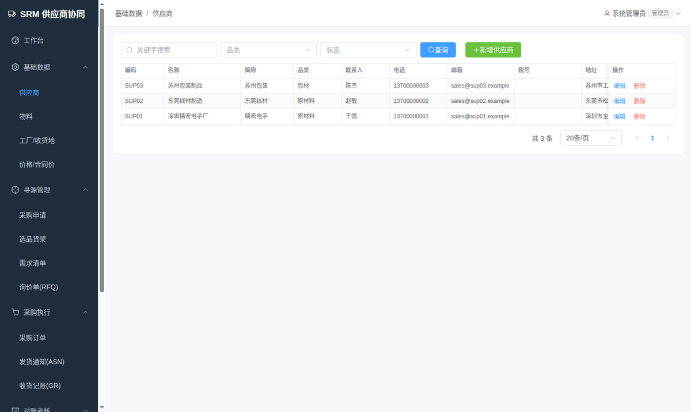

### 4.2 寻源管理

采购申请支持 `DRAFT → SUBMITTED → APPROVED → ORDERED`，审批后一键转采购订单；询价单发布给多家供应商报价，授标生成订单。

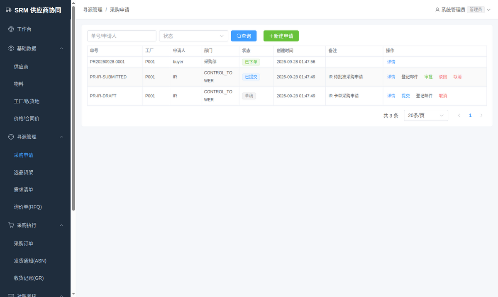

选品货架按品类展示在用物料，选工厂后只显示该厂可买池；卡片列出协议价及每一档数量折扣，起订量未达或当天无协议价时留空不编造。支持收藏、浏览记录和优惠券（生效/失效日、可用次数，加入需求清单时扣一次）。

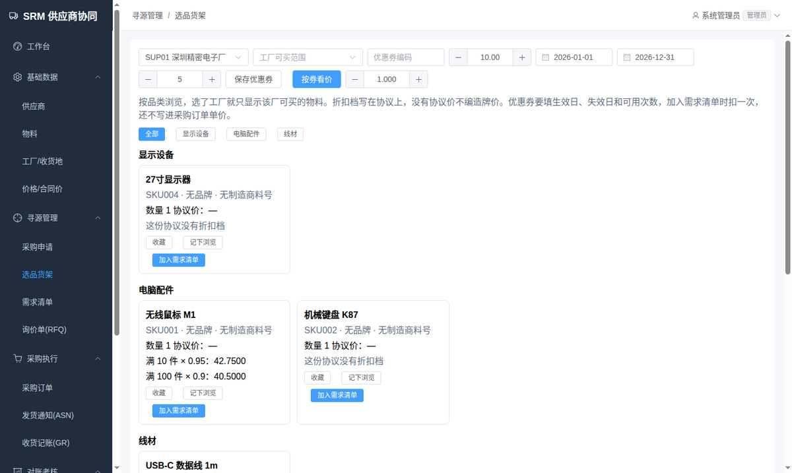

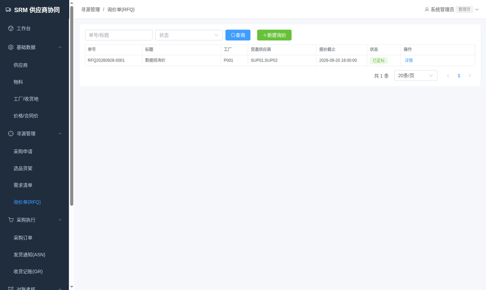

### 4.3 采购执行

采购订单审批后下发 SAP，回写 SAP PO 号；供应商门户确认后进入发货。订单行空单价时自动取当天有效协议价并按数量折扣档折算。

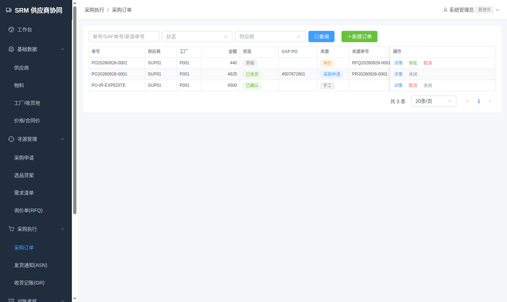

ASN 创建即同步 WMS 生成入库单；WMS 收货后通过回调或 30 秒轮询回传，SRM 生成收货单并计算 `合格数 = 收货数 − 拒收数`，随即以 MIGO 101 向 SAP 过账。

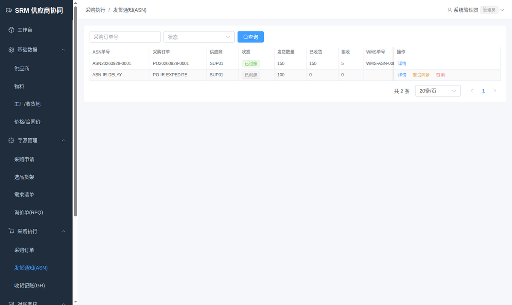

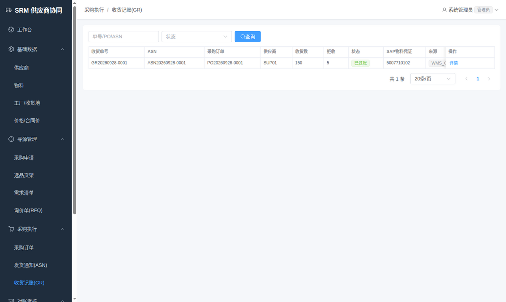

### 4.4 对账考核

**发票自动三单匹配**：供应商提交发票即触发匹配，规则为「开票数量 ≤ 收货合格数 − 已开票数」且单价在容差内；通过置 `MATCHED`，不符置 `MISMATCH` 并把原因写入备注，采购员可修正后重新对账，审批后向 SAP 过账。

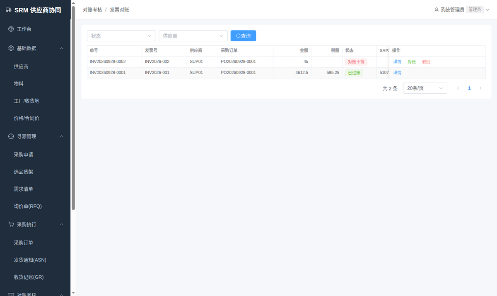

**供应商考核**：每张收货单产生一条考核明细，按月汇总。

| 指标 | 权重 | 口径 |
| --- | --- | --- |
| 准时率 | 40% | 收货日期 ≤ 订单交期 |
| 数量准确率 | 30% | 收货数 / 订单数 |
| 质量率 | 30% | 合格数 / 收货数 |
| WMS 评分 | 可选，默认 0.3 混合 | 仓储回传的供应商评分 |

评级：≥90 A，≥80 B，≥70 C，其余 D。

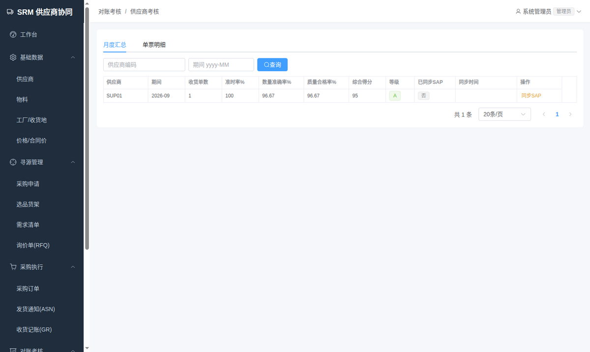

### 4.5 供应商门户

供应商账号绑定 `supplierCode`，只看得到、只操作得了自己的询价、订单、发货、收货、发票与考核；直接访问采购员页面会被路由守卫拦回。

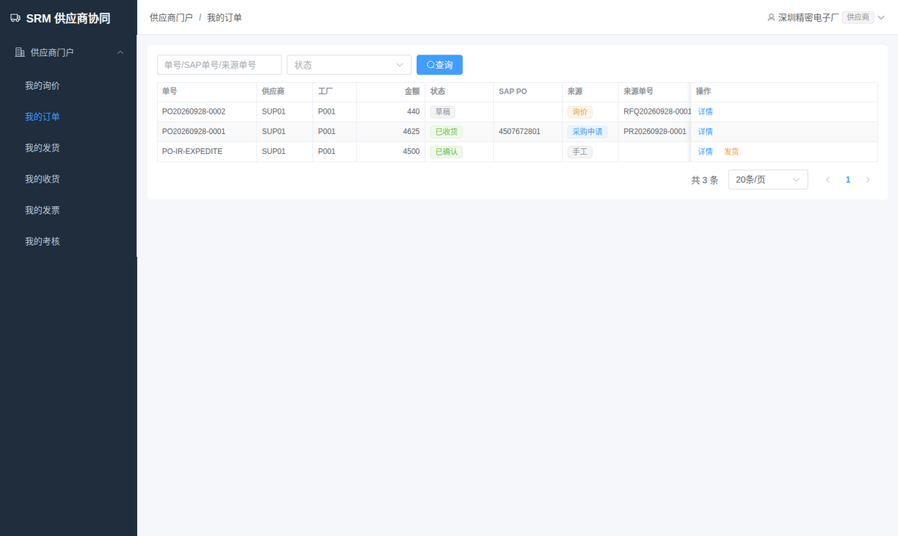

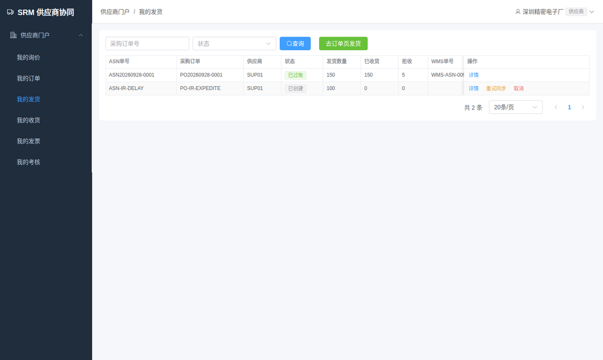

### 4.6 集成与运维

每次与 SAP / WMS 的往来都记录方向、动作、单号、请求/响应报文与结果，失败可在页面重试；操作日志记录谁在何时对哪张单做了什么。

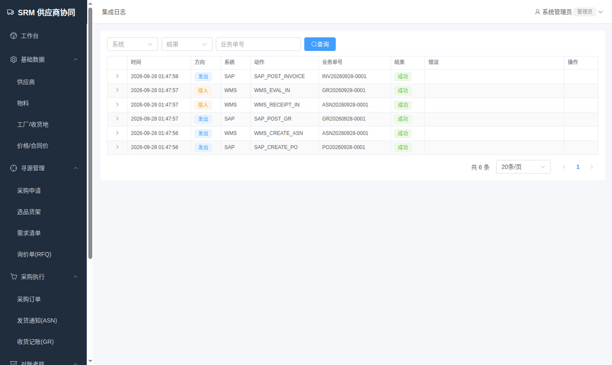

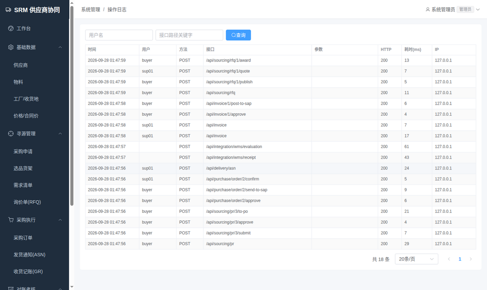

---

## 5. 单据状态机

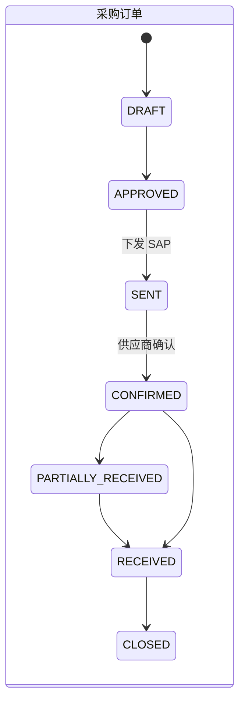
```mermaid
stateDiagram-v2
  direction LR
  state 采购订单 {
    [*] --> DRAFT
    DRAFT --> APPROVED
    APPROVED --> SENT: 下发 SAP
    SENT --> CONFIRMED: 供应商确认
    CONFIRMED --> PARTIALLY_RECEIVED
    PARTIALLY_RECEIVED --> RECEIVED
    CONFIRMED --> RECEIVED
    RECEIVED --> CLOSED
  }
```

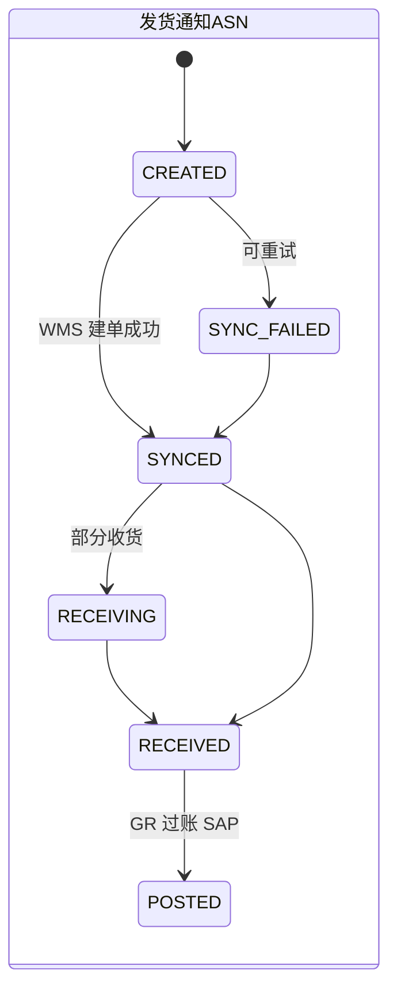
```mermaid
stateDiagram-v2
  direction LR
  state 发货通知ASN {
    [*] --> CREATED
    CREATED --> SYNCED: WMS 建单成功
    CREATED --> SYNC_FAILED: 可重试
    SYNC_FAILED --> SYNCED
    SYNCED --> RECEIVING: 部分收货
    RECEIVING --> RECEIVED
    SYNCED --> RECEIVED
    RECEIVED --> POSTED: GR 过账 SAP
  }
```

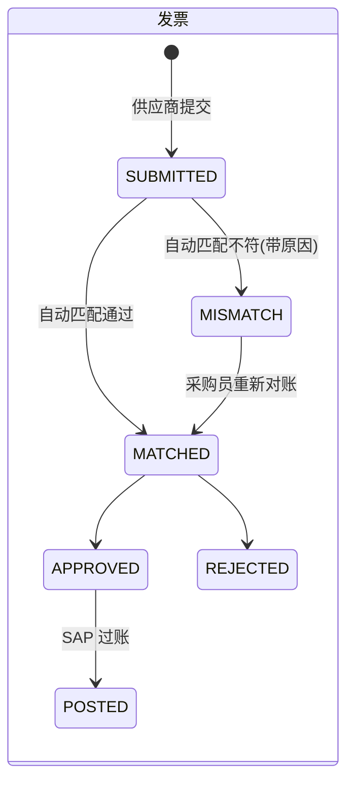
```mermaid
stateDiagram-v2
  direction LR
  state 发票 {
    [*] --> SUBMITTED: 供应商提交
    SUBMITTED --> MATCHED: 自动匹配通过
    SUBMITTED --> MISMATCH: 自动匹配不符(带原因)
    MISMATCH --> MATCHED: 采购员重新对账
    MATCHED --> APPROVED
    APPROVED --> POSTED: SAP 过账
    MATCHED --> REJECTED
  }
```

其他：PR `DRAFT → SUBMITTED → APPROVED → ORDERED`（可 REJECTED / CANCELLED）；RFQ `DRAFT → PUBLISHED → QUOTING → AWARDED`；GR `PENDING → POSTED / POST_FAILED`。

---

## 6. 外部系统集成

| 方向 | 接口 | 触发点 | 模式 |
| --- | --- | --- | --- |
| SRM → SAP | 创建采购订单 | PO 审批后 | mock 返回 `45xxxxxxxx`；http 走 S/4 OData `API_PURCHASEORDER_PROCESS_SRV`；ecosystem 打本套 SAP 演示 `/api/mm/*` |
| SRM → SAP | 收货过账 MIGO 101 | GR 生成后 | 同上，mock 返回 `50xxxxxxxx` 物料凭证 |
| SRM → SAP | 发票过账 | 发票审批后 | 同上 |
| SRM → SAP | 供应商考核同步 | 考核生成后 | 同上 |
| SRM → WMS | 创建入库单（ASN） | ASN 创建时 | mock；http 登录 WMS 取 token，401 自动刷新 |
| WMS → SRM | 收货回调 `POST /api/integration/wms/receipt` | WMS 收货 | `X-Api-Key`，支持增量 / 累计（`cumulative=true`） |
| SRM → WMS | 轮询 ASN 状态 | 每 30 秒 | 仅 WMS 状态为 RECEIVED / PUTAWAY / CLOSED 才生成 GR |
| WMS → SRM | 供应商评分 | 收货完成 | 按 `SRM_EVAL_WMS_WEIGHT` 混入考核 |
| 控制塔 → SRM | Open IR：单据快照、采购建议、提交/审批 PR、催单 | 控制塔指令 | `X-Api-Key`，幂等键 `type|业务键|key` |

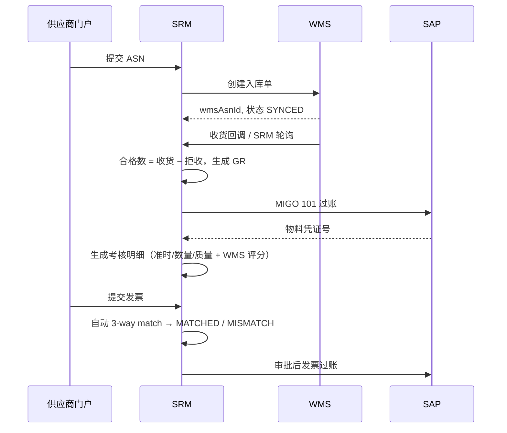
```mermaid
sequenceDiagram
  participant SUP as 供应商门户
  participant SRM
  participant WMS
  participant SAP
  SUP->>SRM: 提交 ASN
  SRM->>WMS: 创建入库单
  WMS-->>SRM: wmsAsnId, 状态 SYNCED
  WMS->>SRM: 收货回调 / SRM 轮询
  SRM->>SRM: 合格数 = 收货 − 拒收，生成 GR
  SRM->>SAP: MIGO 101 过账
  SAP-->>SRM: 物料凭证号
  SRM->>SRM: 生成考核明细（准时/数量/质量 + WMS 评分）
  SUP->>SRM: 提交发票
  SRM->>SRM: 自动 3-way match → MATCHED / MISMATCH
  SRM->>SAP: 审批后发票过账
```

---

## 7. 测试与验证

| 验证项 | 方式 | 结果 |
| --- | --- | --- |
| 后端编译 / 单元测试 | `mvn -q test`（7 个测试类：目录匹配、货架价格、优惠券限次、Open IR、WMS 回传、ecosystem SAP、邮件审批登记） | 通过 |
| 前端构建 | `npm run build` | 通过 |
| 全链路冒烟（mock） | `scripts/smoke.sh`：PR→PO→SAP→确认→ASN→收货→GR→SAP→考核→发票自动匹配（含 MISMATCH 超量用例） | 通过 |
| 与真实 WMS 联调 | `scripts/smoke-wms.sh`，`SRM_WMS_MODE=http` 对接本机 WMS 8080：ASN 落入 WMS、WMS 收货、SRM 轮询生成 GR 并过账 | 通过 |
| 发票对账加固 | 冒烟覆盖：订单归属校验、数量/单价非法、同一订单行多条明细按合计校验、不符原因去重截断（PR #20–#22） | 通过 |
| 浏览器端到端（录屏） | 采购员 + 供应商双角色全流程、供应商数据隔离、越权跳转、错误密码、15 个管理页面无控制台报错 | 通过 |

**未覆盖**：真实 S/4 HANA 环境；WMS 以外的真实外部系统；多工厂并发收货压测。

---

## 8. 建设成果

1. 一条主链路闭环，单据从申请到发票在同一系统内可追溯，SAP / WMS 凭证号回写到单据。
2. 供应商自助门户：确认、发货、开票、查考核，数据按供应商隔离。
3. 收货即算合格数、即过账、即考核，三件事由一次 WMS 回传驱动，无人工二次录入。
4. 发票提交即自动三单匹配，不符原因可读可改，避免对账争议。
5. 集成可观测：每次往来有日志、有报文、可重试。
6. 零安装演示：H2 + mock 模式双击运行包即可展示；切环境变量即可对接真实 SAP / WMS。
7. 开放接口：控制塔可拉快照、下采购建议、审批与催单，幂等保证重复指令安全。

---

## 9. 后续计划

| 方向 | 内容 |
| --- | --- |
| SAP 生产对接 | 在客户 S/4 环境验证 OData 鉴权（CSRF/Basic/OAuth）、公司代码、移动类型与税码映射 |
| 结算深化 | 付款计划、对账单、供应商发票批量导入 |
| 寻源深化 | 多轮报价、比价矩阵、合同到期提醒 |
| 绩效深化 | 考核指标可配置、季度/年度汇总、供应商整改单 |
| 运维 | MySQL 生产库、审计日志归档、通知（邮件/企微）网关接入 |
